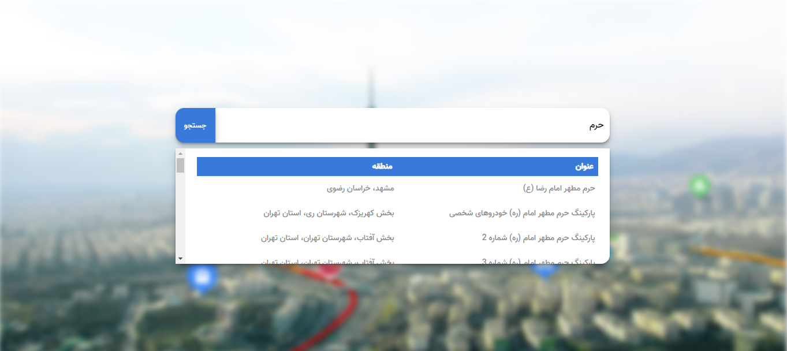

In this project, which is done with React, the user can enter the name of the desired location and the addresses related to the searched location are displayed to the user.
In this program, Neshan routing API is used.

